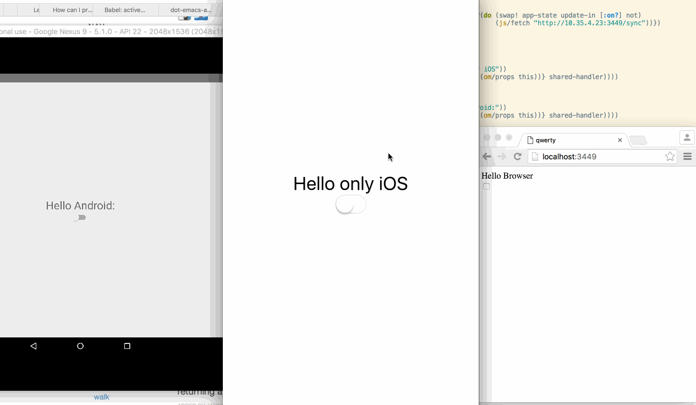

# ktoa [](https://jarkeeper.com/artemyarulin/ktoa)
[](http://clojars.org/ktoa)

Set of useful helpers and wrappers around React Native for ClojureScript development. Handy in case you want to write cross platform Om-Next components. With ktoa you can achieve that: 

## API

#### ktoa.core

- `react-native` - With figwheel-react-native approach we cannot simply do `require("react-navtie")` as react packager catches this import and convert module name to the full path. As we download new files and `eval` it by ourselves we avoid react packager. This variable requires `react-native` with a right path, abstracting this workaround for you. On non RN environments returns nil
- `react-native-root` - React gives root element index as a rootTag property when we register component using AppRegistry.registerRunnable. When we are in a development mode and would like to remount our component we don't have an access to rootTag, so we re-mount to index 1 as React starts with it. Keep in mind that if you have multiple RNRootView you may want to remount to index 2,3, etc
- `os` - Returns nil for non react-native environments or `:ios` or `:android` depending on current platform
- `register!(app-name mount node)` - If we have any app in registry - simply re-mount the app to the root node in order to reload it. If nothing exists yet - register in a usual way. If we are in a browser - mount to the browser node. Example:
``` clojure
(ktoa/register! "AwesomeApp"                                        ;; App name, same as in your RCTRootView
                #(om/add-root! (om/reconciler ktoa-om/om-options)   ;; Function which accept element to mount to
                               RootComponent
                               %)
                #(.querySelector js/document "#app"))               ;; Optional, function which returns browser node to mount to. Only in case of cross platform development
```
- `class[property-map]` - Wrapper around `React.createClass`. Useful in case you are not using any frameworks like Om/Reagent/etc.
- `register-component` - Wrapper around `AppRegistry.registerComponent`. Example:
``` clojure
(def root-component (core/class {:render #(components/text {:onPress (fn[](start-figwheel))} "Start figwheel")
                                 :componentWillMount #(start-figwheel)}))
(core/register-component app-name (constantly root-component))
```

#### ktoa.components
- `element[element opts & children]` - Helper for React Native component: Allows developer to use Clojure maps as component options and add multiple children. Example:
``` clojure
(def style {:style {:flex 1
                    :justifyContent "center"
                    :alignItems "center"}})
(view style
        (switch nil nil)
        (text nil "Hello"))
```
- This namespace currently exposes following wrapped with `element` React Native components:
    -  activity-indicator-ios
    -  date-picker-ios
    -  drawer-layout-android
    -  image
    -  list-view
    -  map-view
    -  modal
    -  navigator
    -  picker-ios
    -  progress-bar-android
    -  progress-view-ios
    -  pull-to-refresh-view-android
    -  scroll-view
    -  segmented-control-ios
    -  slider-ios
    -  switch
    -  tab-bar-ios
    -  tab-bar-ios-item
    -  text
    -  text-input
    -  toolbar-android
    -  touchable-highlight
    -  touchable-native-feedback
    -  touchable-opacity
    -  touchable-without-feedback
    -  view
    -  view-pager-android
    -  web-view

#### ktoa.repl

Using this namespace you can create figwheel bridge file. In your app create:
``` clojure

;; cat src/repl/repl.cljs

(ns repl.repl
  (:require [ktoa.repl :as repl :refer-macros [start-repl]]))

(start-repl {:app-name "RootViewRN" ;; same as your RCTRootView using
             :base-url "http://localhost:3449/js"
             :root-ns  "app.core"
			 ;; If you wish to require any external packages in your code - specify it here. See issue #1
			 :modules ["react-native" "react-timer-mixin"]})

;; cat project.clj

(defproject om-next-ios-pure "0.1.0"
  :dependencies [[org.clojure/clojure "1.7.0"]
                 [org.clojure/clojurescript "1.7.189"]
                 [figwheel-sidecar "0.5.0-SNAPSHOT"]
                 [com.cemerick/piggieback "0.2.1"]
                 [ktoa "0.1.2-SNAPSHOT"]]
  :plugins [[lein-cljsbuild "1.1.1"]
            [lein-figwheel "0.5.0-1"]]
  :source-paths ["src"]
  :repl-options {:nrepl-middleware [cemerick.piggieback/wrap-cljs-repl]
                 :init (do (use 'figwheel-sidecar.repl-api)(start-figwheel!))}
  :cljsbuild {:builds {:repl {:source-paths ["src/repl" ]
                              :compiler {:optimizations :advanced
                                         :output-to "ios/js/app.js"}}
                       :dev {:source-paths ["src/app" ]
                             :figwheel true
                             :compiler {:main app.core
                                        :output-dir "resources/public/js"}}}})

```
Then simply run `lein cljsbuild once repl && lein repl` and open your RN project. nrepl is supported as well

#### ktoa.om

`om-options` - Om-Next reconciler accepts optional render and unmount function which has a different implementation in RN and browser React. In case non RN environments this function returns empty map so you can easily merge this options all the time

`set-global!` - Om-Next using React global under the hood. Currently there is no way how we can configure it, so here we set minimum React version of this global

#### ktoa.state

Experimental: You can now persist the app state on a disk and automatically sync it in real time between clients.

Add following line to your `project.clj`: `:figwheel {:ring-handler ktoa.state/handler}` and create a file `state.cljs` like this:
```
(ns app.state (:require [ktoa.state :as ktoa :refer-macros [persist]]))
(defonce app-state (atom {}))
(persist app-state)

```
That's it! As long as figwheel works state will sync between clients. How does it work? Whenever you change the atom, watcher handles it, calls handler, handler **appends string** to this file (that's why it's better to create a separate one) like `reset! app-state [new-shiny-state]`. Read more in the [ktoa.state](src/ktoa/state.cljc) and in [the issue](https://github.com/artemyarulin/ktoa/issues/2)

## Example

See [om-next-cross-platform-template](https://github.com/artemyarulin/om-next-cross-platform-template) for usage example

## Status

Early development, experimenting with right lib design. Integrating it with my app. Although I'm using Om-Next ktoa should be framework agnostic - if something doesn't work for your favorite one or you with to extend this lib - PR are very welcome!

There are a lot of discussion happens in http://clojurians.net, on #cljsrn channel. Feel free to join

# Credits

Big thanks to decker405 and his awesome idea how to use Figwheel with RN: https://github.com/decker405/figwheel-react-native
